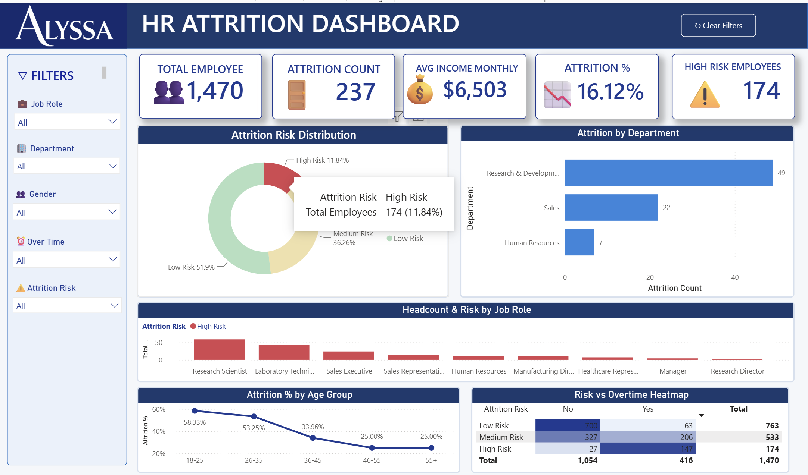
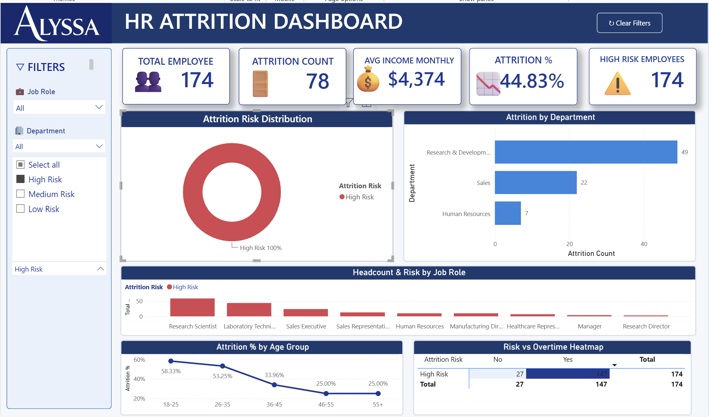
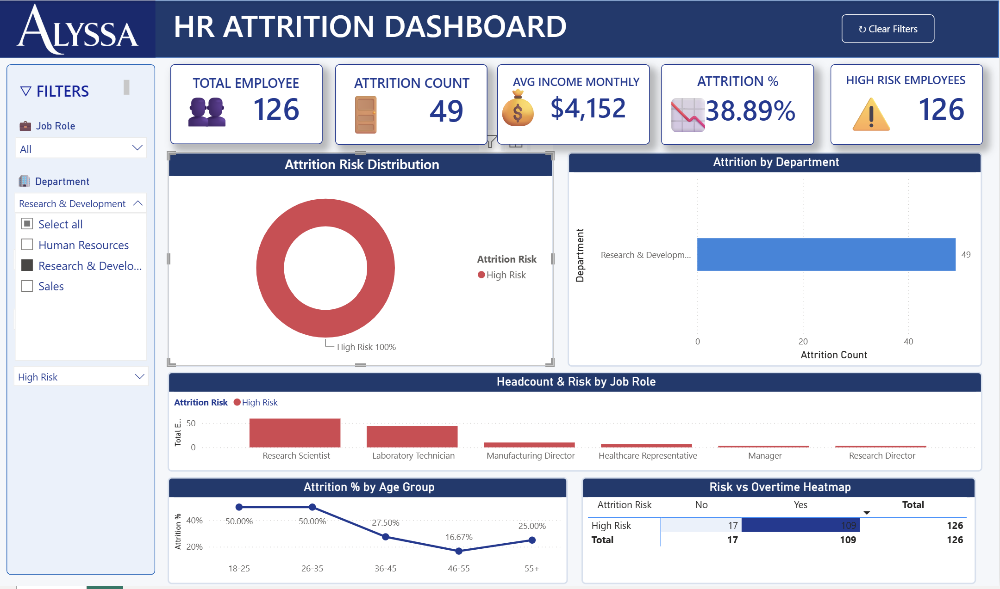
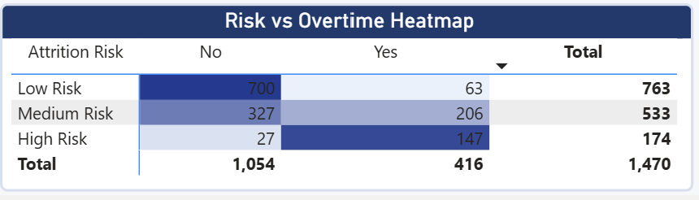

# 📊 HR Attrition Dashboard — Power BI

> Interactive HR analytics dashboard analyzing employee attrition patterns across **1,470 employees** and **31 features**, featuring a custom **4-factor Employee Attrition Risk scoring model** that segments the workforce into High / Medium / Low risk tiers for proactive retention strategy.


*Custom tooltip on hover reveals segment-specific metrics; donut acts as cross-filter across all charts on the page.*

---

## 🎯 Project Overview

Employee attrition costs companies an average of **6–9 months of salary per departing employee**. Most HR dashboards stop at *describing* attrition; this project goes further by **predicting risk** — letting HR teams act *before* an employee leaves.

The dashboard combines descriptive analytics (who left, from which department, what age group) with a **rule-based risk-scoring model** built directly in DAX. The result: a single interactive view where HR can filter, drill down, and identify which segments need intervention.

**Dataset**: IBM HR Analytics Employee Attrition (`WA_Fn-UseC_-HR-Employee-Attrition.csv`) — 1,470 rows × 35 columns, publicly available sample.

---

## ✨ Key Features

- 🎯 **Custom Attrition Risk Model** — 4-factor weighted scoring engine classifying every employee into High / Medium / Low risk
- 📊 **6 interactive visuals** — KPI cards, donut, bar, stacked column, line, and conditional-format matrix heatmap
- 🔍 **5 cross-filtering slicers** — Job Role, Department, Gender, OverTime, Risk
- 💡 **Custom report-page tooltips** — hover any risk segment to see mini-dashboard
- 🎨 **Branded navy theme** — semantic red/yellow/green palette for risk semaphore
- ⚡ **Optimized data model** — Power Query M for ETL, DAX for measures and calculated columns

---

## 🧪 Custom Risk Scoring Methodology — The Wow Factor

Every employee receives a score **0–8** based on 4 weighted factors. The score is then classified into a risk tier.

### Scoring rules

| Factor | Condition | Points |
|---|---|---|
| **OverTime** | Yes | +2 |
|  | No | 0 |
| **Job Satisfaction** | 1 (Low) | +2 |
|  | 2 (Medium) | +1 |
|  | 3–4 (High / Very High) | 0 |
| **Distance from Home** | > 20 km | +2 |
|  | 10–20 km | +1 |
|  | < 10 km | 0 |
| **Monthly Income** | < $3,000 | +2 |
|  | $3,000 – $6,000 | +1 |
|  | > $6,000 | 0 |

### Classification

| Total Score | Risk Tier | Color |
|---|---|---|
| ≥ 5 | 🔴 **High Risk** | `#DC3545` |
| 3 – 4 | 🟡 **Medium Risk** | `#F4A261` |
| 0 – 2 | 🟢 **Low Risk** | `#28A745` |

### Why these factors?

These 4 features had the strongest correlation with `Attrition = Yes` in exploratory analysis. The model is **deterministic and interpretable** — HR teams can explain *exactly why* an employee is flagged without needing an ML black box.


*Filtering by Attrition Risk = High Risk surfaces **174 employees** (11.84% of workforce). Attrition rate within this segment is **44.83%** — nearly 3× the overall 16.12% baseline. These are the priority retention targets.*

### DAX implementation

```dax
Attrition Risk Score = 
    VAR OvertimeScore = IF(HR_Data[OverTime] = "Yes", 2, 0)
    VAR SatisfactionScore = 
        SWITCH(HR_Data[JobSatisfaction], 1, 2, 2, 1, 0)
    VAR DistanceScore = 
        SWITCH(TRUE(),
            HR_Data[DistanceFromHome] > 20, 2,
            HR_Data[DistanceFromHome] >= 10, 1,
            0)
    VAR IncomeScore = 
        SWITCH(TRUE(),
            HR_Data[MonthlyIncome] < 3000, 2,
            HR_Data[MonthlyIncome] <= 6000, 1,
            0)
    RETURN OvertimeScore + SatisfactionScore + DistanceScore + IncomeScore

Attrition Risk = 
    SWITCH(TRUE(),
        HR_Data[Attrition Risk Score] >= 5, "High Risk",
        HR_Data[Attrition Risk Score] >= 3, "Medium Risk",
        "Low Risk")
```

---

## 🔍 Interactive Filtering & Drill-Down

The dashboard supports **multi-dimensional filtering** — slicers stack, allowing HR teams to isolate very specific cohorts.


*Combined filter: **Department = Research & Development** + **Attrition Risk = High Risk**. Surfaces 126 R&D employees flagged as High Risk, with a 38.89% attrition rate — significantly higher than baseline. The donut, bar, line, and heatmap all sync to the same filter context, and visuals automatically hide rows without data.*

This kind of drill-down is essential for **targeted retention interventions** — instead of generic company-wide policies, HR can act on the exact segment that needs attention.

---

## 🌡️ Heatmap Visualization — Row-Normalized Conditional Formatting

One of the more subtle design choices in this dashboard: the **Risk × OverTime heatmap** uses **percentage-within-row** as the gradient basis, not raw counts. This prevents the visual from being dominated by one column (most employees don't work overtime, so raw-count gradient would cluster all color on the "No" side).


*Each row's gradient is independent — letting overtime's relative impact stand out per risk tier.*

### Key insight from this view

- **High Risk row**: 27 (No) vs **147** (Yes) — **84% of High Risk employees work overtime**
- **Low Risk row**: **700** (No) vs 63 (Yes) — only **8% of Low Risk employees work overtime**

> **Conclusion**: OverTime is the single strongest driver of attrition risk in this dataset. Among employees flagged High Risk, the overwhelming majority are working overtime — making OT load a clear lever HR can pull for retention.

### DAX measure powering the gradient

```dax
OT Share within Risk = 
    DIVIDE(
        [Total Employees],
        CALCULATE([Total Employees], ALL(HR_Data[OverTime]))
    )
```

Then in Format → Cell elements → Background color → fx → base on `OT Share within Risk` instead of `Total Employees`.

---

## 🛠 Tech Stack

| Layer | Tool |
|---|---|
| **BI Platform** | Power BI Desktop (2026 build) |
| **Data Transformation** | Power Query (M language) |
| **Calculated Logic** | DAX (Data Analysis Expressions) |
| **Design System** | Custom theme JSON, Segoe UI |
| **Version Control** | Git + GitHub |

---

## 📈 Key Findings

After analyzing the 1,470-employee dataset, the dashboard surfaced these insights:

- 🚨 **Overall attrition rate: 16.12%** (237 of 1,470 employees)
- ⚠️ **174 employees (11.84%) flagged as High Risk** — these are the priority retention targets
- 🏢 **Research & Development** has the highest absolute attrition count and the largest High Risk pool (126 employees)
- ⏰ **Overtime is the strongest single driver** — 84% of High Risk employees work overtime vs only 8% of Low Risk
- 👶 **Age 18–25 group has the highest attrition rate (58.33% within High Risk segment)** — early-career retention is the biggest gap
- 💰 **Income disparity** — High Risk segment averages **$4,374/month** vs $6,503 overall, a $2,000+ gap signaling compensation as a retention lever

---

## 📁 Repository Structure

```
power-bi-hr-attrition/
├── README.md
├── HR_Attrition_Dashboard.pbix       # Power BI source file
├── HR_Attrition_Dashboard.pdf        # Static export for quick preview
├── demo.gif                           # 15-sec walkthrough
├── screenshots/
│   ├── 01-overview-tooltip.png
│   ├── 02-risk-segment.png
│   ├── 03-multi-filter-drilldown.png
│   └── 04-heatmap-detail.png
└── dataset/
    └── WA_Fn-UseC_-HR-Employee-Attrition.csv
```

---

## 🚀 How to Run Locally

1. Install **Power BI Desktop** (free) — [download here](https://powerbi.microsoft.com/desktop).
2. Clone this repo:
   ```bash
   git clone https://github.com/[your-username]/power-bi-hr-attrition.git
   ```
3. Open `HR_Attrition_Dashboard.pbix` in Power BI Desktop.
4. The model auto-loads with the included CSV. Click visuals, slicers, and explore.

> 💡 Don't have Power BI Desktop? Open `HR_Attrition_Dashboard.pdf` for a static preview, or watch `demo.gif` above.

---

## 📚 What I Learned

- Building **rule-based predictive models** in pure DAX without ML frameworks — useful when transparency beats accuracy
- Resolving **circular dependency** in DAX sort-by-column patterns (calc column A sorted by column B that depends on A — fix: sort by a *parallel* score column instead)
- Designing a **report-page tooltip system** for richer hover-state UX
- Configuring **per-row conditional formatting** in matrix visuals using normalized share measures instead of raw counts to avoid gradient skew
- Balancing **cross-filter vs. context** — keeping KPI cards on `Edit Interactions = None` so totals stay visible even when users click a donut slice

---

## 👩‍💻 Author

**Alyssa Chalondra Adimulyo**  
Industrial Engineering @ Universitas Sebelas Maret  
Aspiring Data Analyst with focus on operations analytics and process automation

🔗 **Portfolio**: [uns.id/AlyssaPortfolio](https://uns.id/AlyssaPortfolio)  
💼 **LinkedIn**: [linkedin.com/in/alyssachalondra](https://www.linkedin.com/in/alyssachalondra)  
📧 **Email**: alyssachalondra@gmail.com

---

## 📜 License

This project uses the **IBM HR Analytics Employee Attrition** public sample dataset. The dashboard, DAX measures, scoring model, and visualizations are released under **MIT License** — feel free to fork, adapt, and learn from it.

---

⭐ **If this project helped you understand HR analytics or Power BI scoring models, leave a star!**
